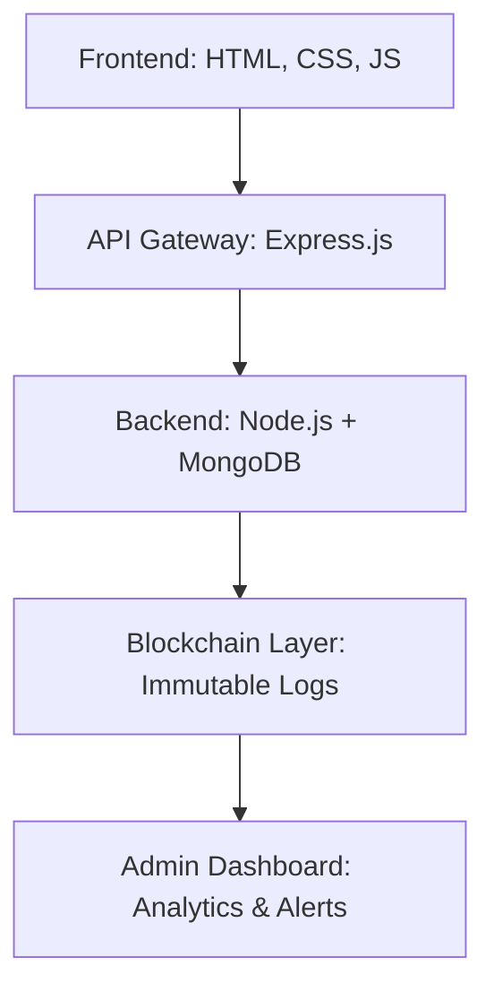
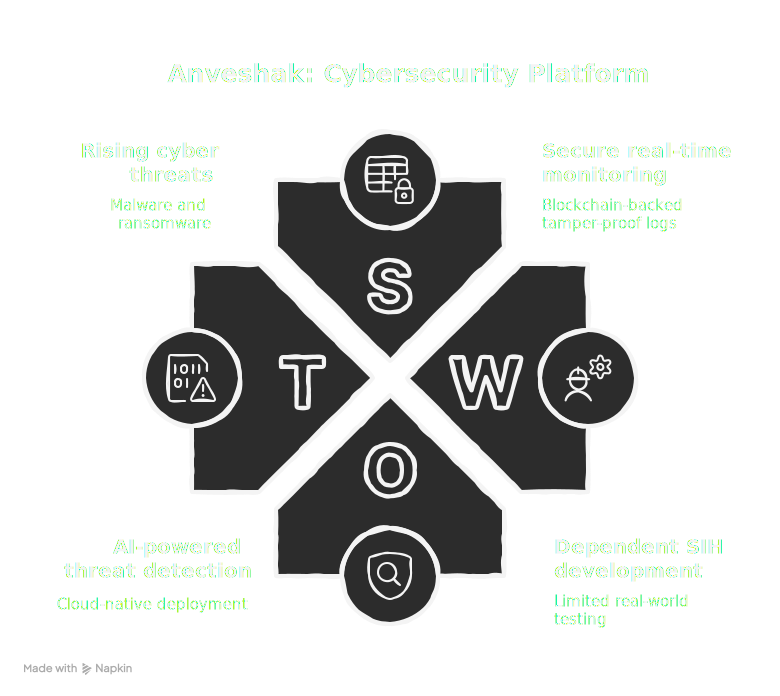

# 🔍 Anveshak | Smart India Hackathon 2025  
> *The Explorer/Detector for Nation’s Critical Security*

---

## 📖 About the Project
**Anveshak** (meaning *Explorer/Detector*) is a **cybersecurity platform** built for **real-time threat detection** in **nuclear plants, defense systems, and critical infrastructure**.  
It ensures **secure monitoring, transparent incident tracking, and tamper-proof storage** using **Blockchain + AI-driven analytics**.  

✨ Developed during **Smart India Hackathon (SIH) 2025** by Team **BruteForce Coders**.  

---

## 🚨 Problem
⚡ Cyber threats to **critical infrastructure** are rising:  
- 🦠 Malware injections & ransomware  
- 🔑 Insider threats & unauthorized access  
- 📝 Tampered or deleted system logs  

❌ Existing systems fail due to:  
- Weak log integrity  
- No unified monitoring system  
- Delayed detection & response  

---

## ✅ Our Solution
**Anveshak** provides a **unified security ecosystem**:  
🔹 Real-time **incident monitoring**  
🔹 Live **dashboard & analytics**  
🔹 **Blockchain-backed logs** (tamper-proof 🔒)  
🔹 Automated **alerts & notifications**  
🔹 Scalable for **multi-agency use**  

---

## 🌟 Key Features
✨ **Incident Reporting** – Securely log anomalies, intrusions, or threats  
📊 **Admin Dashboard** – Interactive charts & real-time updates  
⛓️ **Blockchain Integration** – Immutable, verifiable incident storage  
👥 **Role-based Access** – Admins, Operators & Analysts  
🕵️ **Forensic Analysis** – Historical traceability for audits  

---

## 🏗️ System Architecture


## ✨ Features  

✅ **Real-time Incident Monitoring** – Track and visualize system/network incidents instantly.  
✅ **Dashboard Analytics** – Interactive dashboard for insights & decision making.  
✅ **Incident Reports** – Store and retrieve critical logs securely.  
✅ **Blockchain-Powered Security** – Ensures **immutability, transparency, and trust**.  
✅ **User Authentication** – Admin & user-based secure login.  
✅ **Scalable Frontend & Backend** – Built with modular architecture.  

---

## 🏗️ Tech Stack  

### 🌐 Frontend  
- **HTML, CSS, JavaScript** – Clean UI/UX  
- **Dashboard** – Dynamic charts, incident logs, reports  

### ⚙️ Backend  
- **Node.js + Express.js** – RESTful APIs  
- **MongoDB** – Incident & log storage  
- **Blockchain Layer** – Immutable storage for threat data  

### 🔒 Why Blockchain?  
- ⛓️ **Tamper-proof logs** – No unauthorized modifications  
- 🔑 **Decentralized trust** – Ensures transparency  
- 🛡️ **Audit-friendly** – Easy verification during cyber audits  

---

## 📂 Project Structure  

```bash
Anveshak/
├── backend/                  # Server-side code
│   ├── server.js              # Entry point
│   ├── .env                   # Environment variables
│   ├── models/                # MongoDB Schemas
│   │   ├── Incident.js
│   │   └── Log.js
│   ├── utils/                 # DB & blockchain helpers
│   │   └── db.js
│   └── routes/                # API routes
│       ├── incidents.js
│       └── logs.js
│
├── frontend/                  # Frontend (UI)
│   ├── block.html
│   ├── dashboard.html
│   ├── login.html
│   ├── addincident.html
│   ├── surces.html
│   ├── incidents.html
│   ├── logs.html
│   ├── assets/                # CSS, JS, images
│
└── README.md

```
⚡ Quick Start
1️⃣ Clone the repository
 ```bash
    git clone https://github.com/your-username/anveshak.git
    cd anveshak
```
2️⃣ Setup Backend
```bash
    cd backend
    npm install
```
3️⃣ Configure Environment
```bash
   PORT=5000
   MONGO_URI=your_mongo_connection
   PRIVATE_KEY=your_blockchain_private_key
```
4️⃣ Run Backend
```bash
   node server.js
   nodemon server.js
```
5️⃣ Start Frontend

Simply open any of the following in a browser 🌍:

```bash

frontend/block.html

frontend/dashboard.html

frontend/login.html

frontend/addincident.html

frontend/surces.html

frontend/incidents.html

frontend/logs.html

```

## 🛠️ How Anveshak Works  

<p align="center">
  
</p>  

---

## 📈 SWOT Analysis  

<p align="center">
  
</p>  

## 📊 How It Works  

- 🚦 **Incidents reported** → Stored securely in **MongoDB**.  
- ⛓️ **Blockchain Layer** → Validates & secures logs for immutability.  
- 📡 **Dashboard** → Displays incidents, analytics, and reports in real-time.  
- 🛠️ **Admin/User Actions** → Role-based access for managing threats.  

---


## 🚀 Future Scope  

- 🤖 **AI-powered anomaly detection**  
- 📡 **IoT Sensor Integration**  
- ☁️ **Cloud-native deployment**  
- 🔍 **Threat intelligence sharing network**  

---

## 🏆 Acknowledgement  

This project was built for **Smart India Hackathon (SIH)** 🇮🇳 by **Team BruteForce Coders**.  
